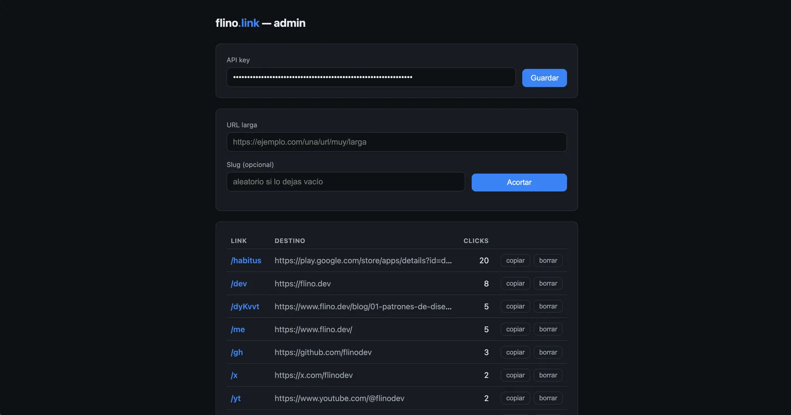

Quería dos cosas: links cortos bajo mi propia marca (cada link que comparto apunta tráfico hacia este sitio) y una excusa real para operar un sistema completo en el edge — DNS, cómputo distribuido, storage, autenticación y un dashboard — en producción y con costo cero de infraestructura.

El resultado es [flino.link](https://flino.link/me): un acortador que responde en menos de 10 ms desde más de 300 ubicaciones, corre enteramente en el tier gratuito de Cloudflare, y cuyo único gasto es el dominio: $4.68 al año. En esta entrada explico las decisiones de diseño, que es donde está lo interesante.

### La arquitectura en 30 segundos

Un solo Cloudflare Worker atiende todo el dominio:

- **`GET /<slug>`** — el camino caliente. Una lectura a Workers KV (replicado globalmente) y un redirect `302`. Nada más toca ese camino.
- **`/api/links`** — API REST con autenticación Bearer para crear, listar y borrar links.
- **`/admin`** — un dashboard de una sola página HTML servida inline desde el propio Worker. Sin framework, sin build step.
- Un **Durable Object** con SQLite embebido lleva el conteo de clicks por slug.

Sin servidores, sin contenedores, sin base de datos que administrar. El Worker completo son tres archivos TypeScript y cero dependencias en runtime.

### ¿Por qué un dominio dedicado?

Mi primera idea fue colgar el acortador de una ruta de `flino.dev`. Mala idea: los acortadores atraen abuso — spam, phishing — y sus dominios terminan tarde o temprano en blocklists. Si eso pasa, no quiero que arrastre a mi sitio principal. Un dominio separado aísla esa reputación de riesgo por completo, y un `.link` corto cuesta menos que un café al año.

### KV para los links, Durable Object para los contadores

Aquí está la decisión de diseño central. Workers KV es perfecto para el patrón de un acortador — muchas lecturas, pocas escrituras, lecturas servidas desde el edge — pero sus escrituras son *eventualmente consistentes*: dos incrementos concurrentes en datacenters distintos se pisarían entre sí. Para contar clicks es inservible.

Un Durable Object resuelve exactamente eso: es una instancia única global con almacenamiento SQLite transaccional. Todos los incrementos, vengan del datacenter que vengan, se serializan en un solo punto consistente:

```ts
export class ClickCounter extends DurableObject<unknown> {
  private sql = this.ctx.storage.sql;

  increment(slug: string): void {
    const now = Date.now();
    this.sql.exec(
      "INSERT INTO clicks (slug, count, last_click) VALUES (?, 1, ?) " +
        "ON CONFLICT(slug) DO UPDATE SET count = count + 1, last_click = ?",
      slug, now, now,
    );
  }
}
```

¿Y no se convierte ese punto único en un cuello de botella para los redirects? No, por lo que viene ahora.

### El truco de `waitUntil`: contar clicks con latencia cero

El contrato de un acortador es redirigir *rápido*. Si el redirect tuviera que esperar la escritura en el Durable Object, cada click pagaría un round-trip extra. La solución es `ctx.waitUntil()`: le entrega al runtime una promesa que se ejecuta **después** de enviar la respuesta al visitante.

```ts
const target = await env.LINKS.get(slug);
if (target !== null) {
  // Se ejecuta después de responder — no añade latencia al redirect.
  ctx.waitUntil(counter(env).increment(slug));
  return Response.redirect(target, 302);
}
```

El visitante recibe su `302` con una sola lectura a KV; el conteo ocurre en segundo plano. Analytics gratis, en el sentido literal de la palabra.

### Fallar hacia la marca

¿Qué pasa si alguien visita un slug que no existe, o la raíz del dominio? Nunca un error 404: siempre un redirect a `flino.dev`. Un link roto o borrado no muestra una página fea — muestra mi sitio. Cada camino muerto del sistema se convierte en un touchpoint.

```ts
// Slug inexistente, raíz, o cualquier otra cosa:
return Response.redirect("https://flino.dev", 302);
```

### El dashboard: HTML inline, sin framework

El panel de administración (el de la imagen de arriba) es una constante de TypeScript con un HTML completo que el Worker sirve en `/admin`. La API key se guarda en `localStorage`, el dark mode sale gratis con `prefers-color-scheme`, y crear un link copia el resultado al portapapeles automáticamente. Cero dependencias, cero build, y se despliega junto con el Worker en el mismo `wrangler deploy`.

Para un proyecto de este tamaño, un framework de frontend habría sido más infraestructura que producto.

### Los números

| | |
|---|---|
| Latencia de redirect | < 10 ms desde 300+ ubicaciones |
| Capacidad (tier gratuito) | ~100.000 requests/día |
| Costo de infraestructura | $0/mes |
| Costo total | $4.68/año (el dominio) |
| Dependencias en runtime | 0 |

### Lo que me llevo

1. **El edge cambia los defaults.** Para un servicio de lectura intensiva, la pregunta ya no es "¿qué tan cerca pongo el servidor?" sino "¿por qué habría un servidor?".
2. **Elegir el storage por semántica, no por costumbre.** KV y Durable Objects conviven en el mismo Worker haciendo cada uno lo que sabe hacer: replicación global para leer, consistencia fuerte para contar.
3. **`waitUntil` es el patrón más subestimado de Workers.** Todo lo que no necesita el visitante — métricas, logs, contadores — puede salir del camino crítico.

El código completo está en [GitHub](https://github.com/flinodev/url-shortened), y si quieres ver el sistema funcionando, este link pasa por él: [flino.link/me](https://flino.link/me).
