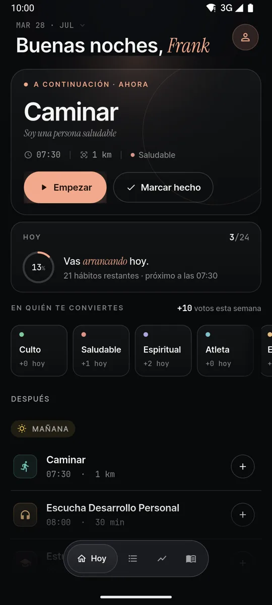

import StackCard from "@components/StackCard.astro";

### Descripción

Aplicación de hábitos publicada en producción en Google Play como [Habitus: Construye identidad](https://play.google.com/store/apps/details?id=dev.flino.habitstracker). El planteamiento no es el de un checklist: cada hábito completado cuenta como un voto hacia una identidad —*soy una persona saludable*, *soy alguien que lee*— y la pantalla principal muestra en quién te estás convirtiendo, no cuántas casillas llevas.

Producto propio de principio a fin: diseño, implementación, reglas de seguridad, assets de la tienda y el proceso de publicación. Sitio del producto en [habitus.to](https://habitus.to).

### Stack tecnológico

  {[
    {
      text: "Flutter",
      icon: "flutter",
      href: "https://flutter.dev"
    },
    {
      text: "Dart",
      icon: "dart",
      href: "https://dart.dev"
    },
    {
      text: "Firebase",
      icon: "firebase",
      href: "https://firebase.google.com"
    },

].map((item) => (

<StackCard text={item.text} icon={item.icon} href={item.href} />
))}

### Arquitectura

- **Offline-first de verdad, no como degradación.** Registrar hábitos, consultar estadísticas y navegar la biblioteca funcionan completos sin conexión; la sincronización con Firestore ocurre cuando vuelve la red. Las tipografías van empaquetadas en los assets para que ni el texto dependa de un servidor.
- **Estructura de logging optimizada para el modelo de cobro de Firestore.** El registro de avance se agrupa para reducir lecturas y escrituras, que es donde una app de hábitos —muchos eventos pequeños al día— se vuelve costosa si se modela ingenuamente.
- **Validación en dos lados.** Reglas de seguridad de Firestore con validación de campos en el servidor, más límites de recursos en el cliente. El cliente no es la autoridad de nada.
- **Firebase App Check** para que la API solo responda a instancias legítimas de la app.
- **Widgets nativos de Android** integrados con Flutter: un contador 2×2 con el progreso del día y una lista 4×2 con hasta siete hábitos pendientes, cada uno con toque directo al detalle.

### Funcionalidades

#### Biblioteca de recursos vinculada a hábitos

Catálogo personal de libros, cursos y audiolibros donde cada fuente se conecta a un hábito: al avanzar con el hábito de lectura, la posición en el libro avanza con él. Es el diferenciador del producto —un tracker de hábitos que sabe *qué* estás leyendo, no solo que leíste.

#### Seguimiento y estadísticas

Heatmap anual por hábito, totales del mes, metas con progreso e insights sobre rachas. Cada hábito tiene pantalla propia con profundidad, no es solo un check.

#### Recordatorios

Notificaciones locales por hábito con navegación directa a la pantalla correspondiente al abrirlas.

### Privacidad

Sin venta ni compartición de datos con terceros para publicidad. Se recolecta el mínimo para operar —correo, hábitos creados y registros de avance— más diagnóstico de errores anónimo. La cuenta y todos sus datos se eliminan desde la app. Detalle completo en [habitus.to/privacidad](https://habitus.to/privacidad).
